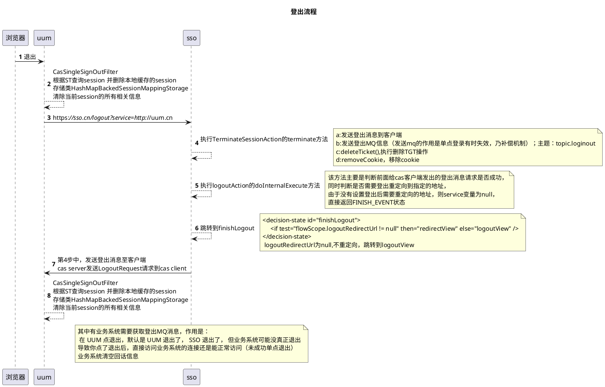

这篇文章，将从登陆、登出流程，详细讲解CAS+Shiro的执行过程。
## 开始
uum：一个基于RBAC（Role-Based Access Control ）的权限系统（CAS client + shiro）
sso：CAS server，负责认证授权

> ### 登陆流程:

这里将以时序图的方式展现。

<!--more-->

```puml
    @startuml
        Title: 登入流程\n
        autonumber
        浏览器 -> uum: 第一次访问\n https://uum.com
        note over uum:spring-mvc.xml中配置了\n<mvc:view-controller>
        uum --> 浏览器: 重定向浏览器
        浏览器 -> uum: 重发请求\n https://uum.com/a
        note over uum:被shiroFilter拦截\n1、${adminPath}/cas = cas\n2、${adminPath}/login = authc\n3、${adminPath}/logout = logout\n4、${adminPath}/** = user\n 所以该请求将被UumUserFilter过滤
        note over uum:UserFilter中，subject.getPrincipal()==null\n当前用户无身份信息
        uum --> 浏览器: 重定向到\n https:////sso.cn/login?service=http:////uum.com/a/cas\n并向浏览器set_cookie:_sid=...(向浏览器写入shiro session id)
        浏览器 -> sso: https:////sso.cn/login?service=http:////uum.com/a/cas
        note over sso:UsernamePasswordSmsCredential【用于接收表单数据】
        sso --> sso: 执行登录流程\n initialFlowSetupAction.doExecute()
        note over sso:WebUtils.putTicketGrantingTicketInScopes:[将TGT放在FlowScope作用域中(第一次无)]\n WebUtils.putWarningCookie:[将warnCookieValue放在FlowScope作用域中]\n WebUtils.putService:[将service放在FlowScope作用域中]\n(将TGT，warnCookieValue和service放在RequestContext作用域中,\n以便在登入流程中的state中进行判断)
        sso --> sso: ticketGrantingTicketCheck，验证TGT
        note over sso:不存在：进入gatewayRequestCheck流程\n 无效：进入terminateSession流程\n 有效：进入hasServiceCheck流程
        sso --> sso: gatewayRequestCheck流程：
        note over sso:有gateway&service:则进入gatewayServicesManagementCheck流程\n 否则进入：serviceAuthorizationCheck流程
        sso --> sso: serviceAuthorizationCheck流程:[验证service]
        note over sso:要做的就是判断RequestContext作用域中是否存在service，如果service存在，查寻service的注册
        sso --> sso: 进入generateLoginTicket流程：
        note over sso:generateLoginTicketAction.generate(flowRequestContext)，生成token\n生成以LT作为字首的loginTicket（例：LT-2-pfDmbEHfX2OkS0swLtDd7iDwmzlhsn），\n并且把loginTicket放到RequestContext作用域中（LT只作为登入时使用的票据）
        note over sso:login token生成规则：******\nDefaultUniqueTicketIdGenerator.getNewTicketId()\nLT-AtomicLong-随机数
        sso --> sso:进入loginMethod流程
        sso --> 浏览器: loginMethod流程\n 进入登录页面，将set_cookie:JSESSIONID=...(cas server的session id写入浏览器)
        浏览器 -> sso: 登录界面：输入用户名密码，点击登录
        note over 浏览器:https:////sso.cn/login;jsessionid=194B34537E3DBCB5366188CBBFF70EA2332232323?service=https:////uum.com/cas\nlt=...[logint token:作为登录时的票据]\nexecution=...\n_eventId=...
        sso -> Dubbo:authenticationViaFormAction.validatorCaptcha()
        note over sso:SmsAuthenticationViaFormAction.validatorCaptcha()\n一.验证输入手机号与用户手机号是否一致\n二.验证验证码与redis验证码是否一致\n调用的相关UUM服务\nexample.createCriteria().andLoginNameEqualTo(loginName)
        note over Dubbo:根据用户名，获取与登录名一致的用户数据\nuserService.selectByExample(example):
        Dubbo --> sso:返回用户数据
        note over sso:验证
        sso --> sso: 验证通过，则进入 realSubmit流程\n authenticationViaFormAction.submit()
        note over sso: cas-servlet.xml\n1.<bean id="authenticationViaFormAction">\n  <property name="centralAuthenticationService">\n2.<bean id="centralAuthenticationService">[applicationcontext.xml]\n   c:authenticationManager-ref="authenticationManager"\n3.<bean id="authenticationManager">[deployerconfigcontext.xml]\n  <entry key-ref="uumScfAuthenticationHandler">\n4.<bean id="uumScfAuthenticationHandler">\n  使用 UUM SCF 方式连接数据库进行用户名、密码认证
        note over sso:AuthenticationViaFormAction.submit()方法\nhandler.authenticate[UumScfAuthenticationHandler.authenticateUsernamePasswordInternal()]
    
        sso -> Dubbo:这个是主要登录流程，调用的相关UUM服务
        note over Dubbo: 一、微信公众号免密登录：\n    userService.loginWithWeixin(username, openid)\n    logService.save(log):登录成功后，异步写入日志信息 \n\n二、微信扫描登录\n    userService.loginWithUserId(userId)\n    logService.save(log):登录成功后，异步写入日志信息 \n\n三、用户名密码登录：\n    userService.login(username, decodedPassword)，获取用户信息[inpass]\n    userLoginLogService.save(userLoginLog);写入用户登录信息\n    logService.save(log):登录成功后，异步写入日志信息
        Dubbo --> sso: 返回数据
        note over sso:AuthenticationViaFormAction.submit()方法\n判断FlowScope和request中的loginTicket是否相同。\n如果不同跳转到错误页面，如果相同，則根据使用者凭证生成TGT（登入成功票据），\n并放到requestScope作用域中，同時把TGT存放至cas server的cache<ticketId,TGT>中
        note over sso:
        note over sso:TGT生成规则：\nTicketGrantingTicket ticketGrantingTicket = new TicketGrantingTicketImpl(\nthis.ticketGrantingTicketUniqueTicketIdGenerator\n.getNewTicketId(TicketGrantingTicket.PREFIX),authentication, \nthis.ticketGrantingTicketExpirationPolicy);\n生成TGT后，需要this.ticketRegistry.addTicket(ticketGrantingTicket);\n因此，保存TGT的地方可以自定义为Redis存储
        sso --> sso:进入sendTicketGrantingTicket流程
        note over sso:获取TGT，并根据TGT生成cookie（TGC）新增到response
        sso --> sso:进入serviceCheck流程，判断flowscope.servcice是否为空
        sso --> sso:进入generateServiceTicket流程\nGenerateServiceTicketAction.doExecute()
        note over sso:Service ticket生成规则：\n获取service和TGT，并根据service和TGT生成以ST为字首的serviceTicket\n（例：ST-2-97kwhcdrBW97ynpBbZH5-cas01.example.org），并把serviceTicket放到requestScope中
        sso --> sso:进入redirect流程
        sso --> 浏览器: 重定向：https:////uum.com/a/cas?ticket=... \n set-cookie: TGC=...(向浏览器返回TGC cookie)\n在URL中携带service token
        浏览器 -> uum: https:////uum.com/a/cas?ticket=...
        uum -> uum:认证授权过程
        note over uum:进行登录\nCAS客戶端的AuthenticationFilter过滤器登录：AuthenticatingFilter.executLogin()\n由于session中获取名为_const_cas_assertion_的assertion物件不存在，但是request有ticket，所以进入到下一个过滤器\nTicketValidationFilter过滤器的validate方法通过httpClient服务CAS server服器端
        note over uum:执行登录：DelegatingSubject.login()\n获取授权信息：DefaultSecurityManager.login\n授权：info = doAuthenticate(token);\n被UumCasFilter拦截\n缓存 CAS Service Ticket 与 Shiro Service ID 的映射关系：cache.put(serviceTicket, sessionId);
        浏览器 -> uum: 重定向\nhttps://uum.com/a
        note over uum:被shiroFilter拦截\n1、${adminPath}/cas = cas\n2、${adminPath}/login = authc\n3、${adminPath}/logout = logout\n4、${adminPath}/** = user\n 所以该请求将被UumUserFilter过滤
        note over uum:UserFilter中，subject.getPrincipal()==null\n当前用户已经有身份信息，有权访问
        uum --> 浏览器: 返回数据
    @enduml
```

> ### 登出流程:

这里将以时序图的方式展现。

**局限性：**
>  * 采用shiro，各业务系统保存了用户信息，无统一保存用户信息容器，当用户改变，无法立即全局生效；并且退出时，需要发送MQ去清空各业务系统的信息，将导致MQ压力增大。
>  * 若设计不合理，SSO认证过程会很长，并且用户授权信息将很大，增加SSO服务压力。

**个人感悟**
针对上面现阶段系统的局限性，以下是个人优化想法：
>  * 认证过程，只验证用户的登录名密码。CAS client根据需要，再调用服务去获取用户授权信息，并将信息统一存放至Redis。
>  * 用户退出，清空Redis中的用户信息，

参考博客：
[shiro 登录授权过程详细解析](https://my.oschina.net/u/2415799/blog/865526)
[CAS 4.1.10 版本服務端原始碼解讀](https://www.codetw.com/lyxepf.html)
[从http验证流程解析CAS单点登录](https://www.jianshu.com/p/5ef9407c71af)
[CAS的详细登录流程](https://blog.csdn.net/qq_34246546/article/details/79493208)
[前端关于单点登录SSO的知识](https://juejin.im/post/5b8116afe51d4538d23db11e)
<!--more-->